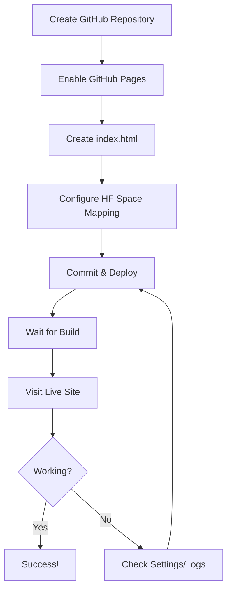

# 🚀 GitHub Pages Site for Hugging Face Space Mapping

A free GitHub Pages site that can be used to map, redirect, or embed Hugging Face Spaces using the free `.github.io` domain.

## 📍 Live Site

**GitHub Pages URL:** https://harshith-reddy-td.github.io/hf-space-site/

**Repository:** [Harshith-reddy-td/hf-space-site](https://github.com/Harshith-reddy-td/hf-space-site)

---

## 🎯 Purpose

This repository demonstrates how to:
1. Create a free GitHub Pages site with a `.github.io` domain
2. Configure the site to map to a Hugging Face Space
3. Use various methods (redirect, embed, custom domain) to connect the two services

---

## 📝 Complete Workflow Documentation

### Step 1: Create a New GitHub Repository

1. Navigate to [github.com/new](https://github.com/new)
2. Enter repository details:
   - **Repository name:** Choose a descriptive name (e.g., `hf-space-site`)
   - **Description:** Add a description (e.g., "GitHub Pages site to map to Hugging Face Space")
   - **Visibility:** Public (required for free GitHub Pages)
3. Select "Add a README file"
4. Click **"Create repository"**

### Step 2: Enable GitHub Pages

1. Navigate to repository **Settings** → **Pages** (under "Code and automation")
2. Under **"Source"**, select:
   - **Source:** Deploy from a branch
   - **Branch:** main
   - **Folder:** / (root)
3. Click **"Save"**
4. GitHub will display your site URL: `https://[username].github.io/[repo-name]/`

### Step 3: Create index.html File

1. Go to the repository main page
2. Click **"Add file"** → **"Create new file"**
3. Name the file: `index.html`
4. Add HTML content (see configuration options below)
5. Click **"Commit changes..."**
6. Confirm the commit

### Step 4: Wait for Deployment

1. Go to **Settings** → **Pages**
2. Wait for the deployment to complete (usually 1-2 minutes)
3. When ready, the page will show: "Your site is live at [URL]"
4. Click **"Visit site"** to view your GitHub Pages site

---

## 🔧 Configuration Options for Hugging Face Space Mapping

### Option 1: Direct Redirect (Meta Refresh)

Add this to the `<head>` section of `index.html`:

```html
<meta http-equiv="refresh" content="0; url=https://huggingface.co/spaces/YOUR-USERNAME/YOUR-SPACE" />
```

**Use case:** Instant automatic redirect to your Hugging Face Space

### Option 2: JavaScript Redirect

Add this script before the closing `</body>` tag:

```html
<script>
    window.location.href = 'https://huggingface.co/spaces/YOUR-USERNAME/YOUR-SPACE';
</script>
```

**Use case:** Programmatic redirect with potential for additional logic

### Option 3: Embed Hugging Face Space (iframe)

Replace YOUR-USERNAME and YOUR-SPACE in the code:

```html
<iframe 
    src="https://YOUR-USERNAME-YOUR-SPACE.hf.space" 
    width="100%" 
    height="800px" 
    style="border:none;">
</iframe>
```

**Use case:** Display the Hugging Face Space directly within your GitHub Pages site

### Option 4: Landing Page with Link

Create a custom landing page with a link to your Space (already implemented in this repo's `index.html`)

**Use case:** Provide information, instructions, or context before users visit your Space

---

## 🔗 Custom Domain Setup (Optional)

To use your own domain instead of `.github.io`:

### Configure GitHub Pages:

1. Go to **Settings** → **Pages**
2. Under **"Custom domain"**, enter your domain (e.g., `www.example.com`)
3. Click **"Save"**
4. GitHub will create a `CNAME` file in your repository

### Configure DNS Records:

**For apex domain (example.com):**
```
Type: A
Host: @
Value: 185.199.108.153
       185.199.109.153
       185.199.110.153
       185.199.111.153
```

**For subdomain (www.example.com):**
```
Type: CNAME
Host: www
Value: [username].github.io
```

### Enable HTTPS:

1. Wait for DNS propagation (can take up to 24 hours)
2. Return to **Settings** → **Pages**
3. Check **"Enforce HTTPS"**

---

## 📊 Repository Structure

```
hf-space-site/
├── README.md           # This file - complete documentation
├── index.html          # Main HTML file with instructions and examples
└── .github/
    └── workflows/      # (Optional) Custom GitHub Actions
```

---

## 🌟 Key Features

✅ **Free GitHub Pages hosting** with `.github.io` domain
✅ **HTTPS enabled** by default
✅ **Multiple mapping options** (redirect, embed, landing page)
✅ **Custom domain support** (optional)
✅ **Automatic deployment** via GitHub Pages
✅ **Full HTML/CSS/JS support** for customization

---

## 🛠️ Technical Details

### GitHub Pages Specifications:
- **Domain format:** `https://[username].github.io/[repo-name]/`
- **Build time:** 1-2 minutes per deployment
- **File size limit:** 100 MB per file
- **Repository size:** Recommended under 1 GB
- **Bandwidth:** 100 GB/month soft limit
- **Builds:** 10 builds/hour limit

### Hugging Face Space Integration:
- **Space URL format:** `https://huggingface.co/spaces/[username]/[space-name]`
- **Embedded URL format:** `https://[username]-[space-name].hf.space`
- **CORS:** Hugging Face Spaces support iframe embedding

---

## 📚 Useful Resources

- [GitHub Pages Documentation](https://docs.github.com/pages)
- [Hugging Face Spaces Documentation](https://huggingface.co/docs/hub/spaces)
- [Custom Domain Configuration](https://docs.github.com/pages/configuring-a-custom-domain-for-your-github-pages-site)
- [GitHub Pages Quickstart](https://docs.github.com/pages/quickstart)

---

## ⚙️ Configuration Requirements

### For GitHub Pages:
1. Repository must be **public** (for free tier)
2. GitHub Pages must be **enabled** in Settings
3. Source must be set to a **branch** (main) and **folder** (/ root)
4. Must have an `index.html` or `README.md` file in the root

### For Hugging Face Space Mapping:
1. Hugging Face Space must be **public** (for embedding)
2. Space must be **running** and accessible
3. Know the correct **Space URL** format
4. Consider **API limits** if embedding multiple users

---

## 🎓 Example Use Cases

1. **Portfolio Site:** Showcase your ML models and demos
2. **Project Landing Page:** Provide context before users interact with your Space
3. **Custom Branding:** Use your own domain to host Hugging Face Spaces
4. **Multi-Space Hub:** Create a central page linking to multiple Spaces
5. **Educational Content:** Combine documentation with interactive demos

---

## 🔄 Workflow Summary



---

## 📦 Deployment Status

- **Status:** ✅ Active and deployed
- **Last Updated:** October 8, 2025
- **Build System:** GitHub Pages (Jekyll)
- **Deployment Method:** Automatic (on push to main)

---

## 👤 Author

**Repository Owner:** Harshith-reddy-td

**Created:** October 8, 2025

---

## 📄 License

This project is available as open source. Feel free to fork, modify, and use for your own projects.

---

## 🤝 Contributing

Contributions, issues, and feature requests are welcome! Feel free to:
- Open an issue
- Submit a pull request
- Share feedback

---

## 💡 Tips & Best Practices

1. **Test locally** before deploying (optional but recommended)
2. **Use descriptive commit messages** for better version control
3. **Keep your Space URL updated** if you change the Space name
4. **Monitor your bandwidth** if expecting high traffic
5. **Enable HTTPS** for custom domains for security
6. **Use meta descriptions** for better SEO
7. **Add a favicon** for professional appearance
8. **Consider caching** for better performance

---

## 📧 Support

For issues or questions:
- Check [GitHub Pages documentation](https://docs.github.com/pages)
- Check [Hugging Face documentation](https://huggingface.co/docs)
- Open an issue in this repository

---

**Visit the live site:** [https://harshith-reddy-td.github.io/hf-space-site/](https://harshith-reddy-td.github.io/hf-space-site/)

---

*Last Updated: October 8, 2025*
